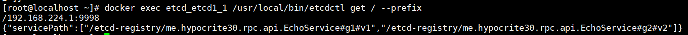

# Etcd 作注册中心

考虑到 Etcd 作为非常轻便高效的 k-v 存储，并且有丰富的功能，网上大部分 RPC 都是仿照 Dubbo 使用 Zookeeper 作为注册中心，因此想使用 Etcd 作为注册中心实现，在 RPC 框架在中使用。

尽管 Etcd 非常轻便和高效，但会带来很多问题需要解决：

1. Zk 存储结构是树形存储，ZNode 节点构成树结构。Etcd 只能实现 k-v 键值对一对一存储，无法注册多个服务实例
2. Zk 能创建临时节点，当服务端断开连接时，即可自动删除节点，实现服务下线，而 Etcd 若要模仿 Zk 做服务下线，做主动下线删除节点可以实现，但遇到 Kill -9 的特殊情况则没法下线服务

Etcd 可以做基本的 CRUD，也有如 Watch/CAS/Lease 这样的高级功能。

对于第一个问题，使用 `Gson` 对服务端的 `host` 列表序列化成 `Json` 再用 【service - host】形式存储

做完功能后发现服务无法下线，针对第二个问题，只能使用一台心跳检测服务器来检测服务端的存活实现服务下线，这一功能比较难实现，只能作为最后的选择。

在得到大佬的指点帮助下，他提供了一种解决思路，对于 【service - host】存储形式，不好对 `Json` 形式的 host 取出，进行下线，可以考虑反转，变成【host - services list】的存储形式，然后对 key （host）做 lease 租约，设置短暂的续租时间，即可完美实现服务下线的功能。

存储形式如下：

客户端需要设置定时任务，用 `ScheduledExecutorService` 来做。定时拉取注册中心的 services list，调用时需要 LoadBalance 获取 `host` ，该逻辑在 `EtcdScheduledUpdater` 中实现。

为防止在调用时在 service discovery 之前还没完成服务的拉取，需要同步阻塞更新一次缓存，这里的启动时机定在`RpcClientProxy` 代理类构造创建时启动，然后再异步开启后台的定时拉取服务。 

