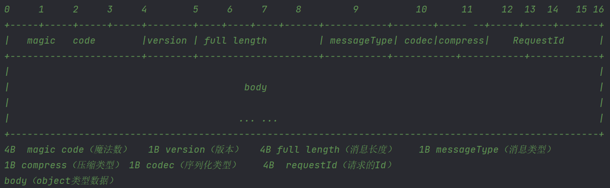

# Netty实现多路复用

## NettyServer

- 是一个 `Component`

```java
@Component
public class NettyRpcServer
```

- 关闭 TCP 延时，即关闭网络 Nagle 算法
- 开启 Netty 心跳机制
- 通道依次加入
  - 心跳处理器，读空闲时间为 30s
  - 自定义 RPC 数据编码器和解码器解决 TCP 粘包拆包问题
  - 开启一个 `ExecutorGroup` 处理 `NettyServer` 逻辑，线程数为两倍处理器数

```java
public void start() {
    // unregister firstly
    ShutdownHook.getShutdownHook().unregister();
    EventLoopGroup bossGroup = new NioEventLoopGroup(1);
    EventLoopGroup workerGroup = new NioEventLoopGroup();
    // number of thread is double number of CPU cores
    DefaultEventExecutorGroup serviceHandlerGroup = new DefaultEventExecutorGroup(
        Runtime.getRuntime().availableProcessors() * 2,
        ThreadPoolUtils.createThreadFactory("service-handler-group", false));
    try {
        ServerBootstrap bootstrap = new ServerBootstrap();
        bootstrap.group(bossGroup, workerGroup)
            .channel(NioServerSocketChannel.class)
            // disable TCP "Nagle" algorithm
            .childOption(ChannelOption.TCP_NODELAY, true)
            // turn on heartbeat
            .childOption(ChannelOption.SO_KEEPALIVE, true)
            .option(ChannelOption.SO_BACKLOG, 128)
            .handler(new LoggingHandler(LogLevel.INFO))
            .childHandler(new ChannelInitializer<SocketChannel>() {
                @Override
                protected void initChannel(SocketChannel socketChannel) {
                    ChannelPipeline pipeline = socketChannel.pipeline();
                    // close connection if server not receive client request in 30s
                    pipeline.addLast(new IdleStateHandler(30, 0, 0, TimeUnit.SECONDS));
                    pipeline.addLast(new RpcMessageEncoder());
                    pipeline.addLast(new RpcMessageDecoder());
                    pipeline.addLast(serviceHandlerGroup, new NettyRpcServerHandler());
                }
            });
        String host = NetUtils.getLocalHostExactAddress().toString();
        ChannelFuture future = bootstrap.bind(NetUtils.newInetSocketAddress(host + ":" + PORT)).sync();
        future.channel().closeFuture().sync();
    } catch (InterruptedException e) {
        log.error("netty server start error", e);
    } finally {
        log.info("shutdown bossGroup and workerGroup");
        bossGroup.shutdownGracefully();
        workerGroup.shutdownGracefully();
        serviceHandlerGroup.shutdownGracefully();
    }
```


- `NettyRpcServerHandler`
  - 继承 `ChannelInboundHandlerAdapter`

```java
@Slf4j
public class NettyRpcServerHandler extends ChannelInboundHandlerAdapter
```

- 设置RPC请求消息体 `RpcEntity` ，若消息类型为心跳请求，则设置请求体类型为 `heart response`，数据为 `PONG`
- 否则交给 `RpcRequestHandler` 处理请求，然后将返回结果设置到请求消息体内，最后回写

```java
@Override
public void channelRead(ChannelHandlerContext ctx, Object msg) {
    try {
        if (msg instanceof RpcEntity) {
            log.info("server receive message: [{}]", msg);
            byte messageType = ((RpcEntity) msg).getMessageType();
            RpcEntity rpcEntity = new RpcEntity();
            rpcEntity.setCodec(SerializationTypeEnum.PROTOSTUFF.getCode());
            rpcEntity.setCompressType(CompressTypeEnum.GZIP.getCode());
            // if message is to check heart beat, send back 'PONG'
            if (messageType == RpcCodecConstants.HEARTBEAT_REQUEST_TYPE) {
                rpcEntity.setMessageType(RpcCodecConstants.HEARTBEAT_RESPONSE_TYPE);
                rpcEntity.setData(RpcCodecConstants.PONG);
            } else {
                RpcRequest rpcRequest = (RpcRequest) ((RpcEntity) msg).getData();
                Object result = rpcRequestHandler.handle(rpcRequest);
                log.info("The return result which server has handled: [{}]", result.toString());
                rpcEntity.setMessageType(RpcCodecConstants.RESPONSE_TYPE);
                if (ctx.channel().isActive() && ctx.channel().isWritable()) {
                    RpcResponse<Object> rpcResponse = RpcResponse.success(result, rpcRequest.getRequestId());
                    rpcEntity.setData(rpcResponse);
                } else {
                    RpcResponse<Object> rpcResponse = RpcResponse.fail(RpcResponseEnum.FAIL);
                    rpcEntity.setData(rpcResponse);
                    log.error("write response message error, message has dropped");
                }
            }
            ctx.writeAndFlush(rpcEntity).addListener(ChannelFutureListener.CLOSE_ON_FAILURE);
        }
    } finally {
        // ensure message buffer is released, or it will occur memory leaks
        ReferenceCountUtil.release(msg);
    }
}
```

- 服务端要处理客户端的心跳，所以单独判断事件是否为 `IdleStateEvent` ，若发现状态为读空闲，则关闭上下文对象

```java
@Override
public void userEventTriggered(ChannelHandlerContext ctx, Object evt) throws Exception {
    if (evt instanceof IdleStateEvent) {
        IdleState state = ((IdleStateEvent) evt).state();
        if (state == IdleState.READER_IDLE) {
            log.info("reader idle check happen, close the connection");
            ctx.close();
        }
    } else {
        super.userEventTriggered(ctx, evt);
    }
}
```


- `RpcRequestHandler` 为服务端处理客户端发来的 RPC 请求
  - 根据客户端请求需要调用的方法名称和方法参数类型，获取方法对象，然后执行方法，最后将结果返回

```java
/**
 * invoke service method
 *
 * @param rpcRequest client request
 * @param service    service object
 * @return invoke result
 */
private Object invokeMethod(RpcRequest rpcRequest, Object service) {
    Object result;
    try {
        Method method = service.getClass().getMethod(rpcRequest.getMethodName(), rpcRequest.getParamTypes());
        result = method.invoke(service, rpcRequest.getParameters());
        log.info("Service: [{}] has invoked method: [{}] successfully", rpcRequest.getInterfaceName(), rpcRequest.getMethodName());
    } catch (NoSuchMethodException | IllegalAccessException | InvocationTargetException e) {
        throw new RpcException("Server invoke method failed", e);
    }
    return result;
}
```


## NettyClient

- 实现 `RequestTransporter` 接口，覆写 `sendRpcRequest` 方法

```java
@Slf4j
public class NettyRpcClient implements RequestTransporter
```

- 依次添加心跳处理器，自定义RPC消息编码器和解码器，ClientHandler 客户端逻辑；心跳处理器设置写空闲时间为 5s ，即 5s Ping 一次服务器

```java
public NettyRpcClient() {
    // initialize resources
    eventLoopGroup = new NioEventLoopGroup();
    bootstrap = new Bootstrap();
    bootstrap.group(eventLoopGroup)
        .channel(NioSocketChannel.class)
        .handler(new LoggingHandler(LogLevel.INFO))
        // timeout period of the connection is 5s
        .option(ChannelOption.CONNECT_TIMEOUT_MILLIS, 5000)
        .handler(new ChannelInitializer<SocketChannel>() {
            @Override
            protected void initChannel(SocketChannel socketChannel) {
                ChannelPipeline pipeline = socketChannel.pipeline();
                // If no data is sent to the server within 15 seconds, a heartbeat request is sent
                pipeline.addLast(new IdleStateHandler(0, 5, 0, TimeUnit.SECONDS));
                pipeline.addLast(new RpcMessageEncoder());
                pipeline.addLast(new RpcMessageDecoder());
                pipeline.addLast(new NettyRpcClientHandler());
            }
        });
    this.serviceDiscovery = ExtensionLoader.getExtensionLoader(ServiceDiscovery.class).getExtension("etcd");
    this.unprocessedRequests = SingletonFactory.getInstance(UnprocessedRequests.class);
    this.channelProvider = SingletonFactory.getInstance(ChannelProvider.class);
}
```


- `NettyRpcClientHandler` 客户端处理信息逻辑
  - 消息对象为 RPC 请求消息体，则判断信息类型是什么
  - 若为服务端的 PONG 响应，则打印日志，完成一次心跳检测
  - 若消息为服务端的响应类型，则客户端取出服务端处理的数据，然后结束掉未完成处理请求对象 `UnprocessedRequest`

```java
@Override
public void channelRead(ChannelHandlerContext ctx, Object msg) {
    try {
        log.info("client receive msg: [{}]", msg);
        if (msg instanceof RpcEntity) {
            RpcEntity tmp = (RpcEntity) msg;
            byte messageType = tmp.getMessageType();
            if (messageType == RpcCodecConstants.HEARTBEAT_RESPONSE_TYPE) {
                log.info("heart [{}]", tmp.getData());
            } else if (messageType == RpcCodecConstants.RESPONSE_TYPE) {
                RpcResponse<Object> rpcResponse = (RpcResponse<Object>) tmp.getData();
                unprocessedRequests.complete(rpcResponse);
            }
        }
    } finally {
        ReferenceCountUtil.release(msg);
    }
}
```

- 客户端在写空闲时，多路复用，发送心跳包 PING 服务器

```java
@Override
public void userEventTriggered(ChannelHandlerContext ctx, Object evt) throws Exception {
    if (evt instanceof IdleStateEvent) {
        IdleState state = ((IdleStateEvent) evt).state();
        if (state == IdleState.WRITER_IDLE) {
            log.info("writer idle happen [{}], PING to the server", ctx.channel().remoteAddress());
            Channel channel = nettyRpcClient.getChannel((InetSocketAddress) ctx.channel().remoteAddress());
            RpcEntity rpcEntity = new RpcEntity();
            rpcEntity.setCodec(SerializationTypeEnum.PROTOSTUFF.getCode());
            rpcEntity.setCompressType(CompressTypeEnum.GZIP.getCode());
            rpcEntity.setMessageType(RpcCodecConstants.HEARTBEAT_REQUEST_TYPE);
            rpcEntity.setData(RpcCodecConstants.PING);
            channel.writeAndFlush(rpcEntity).addListener(ChannelFutureListener.CLOSE_ON_FAILURE);
        }
    } else {
        super.userEventTriggered(ctx, evt);
    }
}
```


- `UnprocessedRequests` 存放客户端发出请求后未处理完的请求
  - 本质就是一个 Map 存储为处理完的 `CompletableFuture` 对象
  - 在 `NettyRpcClient` 发送请求 `sendRpcRequest` 方法中，在发送请求之前将 `Future`  Put 存入 `UnprocessedRequests`
  - 在 `NettyRpcClientHandler`  处理完服务端的返回结果后，`Complete` 结束 Future 任务，即移出 Map

```java
public class UnprocessedRequests {

    /**
     * @key: requestId
     * @value: CompletableFuture
     */
    private static final Map<String, CompletableFuture<RpcResponse<Object>>> UNPROCESSED_RESPONSE_FUTURES = new ConcurrentHashMap<>();

    public void put(String requestId, CompletableFuture<RpcResponse<Object>> future) {
        UNPROCESSED_RESPONSE_FUTURES.put(requestId, future);
    }

    public void complete(RpcResponse<Object> rpcResponse) {
        CompletableFuture<RpcResponse<Object>> future = UNPROCESSED_RESPONSE_FUTURES.remove(rpcResponse.getRequestId());
        if (null != future) {
            future.complete(rpcResponse);
        } else {
            throw new IllegalStateException();
        }
    }
}
```


## RpcMessageCodec

- 为解决 TCP 粘包拆包问题，需要手动编写协议格式，需要包含消息体的消息长度



- 4B 魔数：{(byte) 'c', (byte) 'r', (byte) 'p', (byte) 'c'}
- 1B 版本
- 4B 消息长度：需要包含整个协议的长度，即消息头长度 16B 加上消息体长度
- 1B 消息类型
  - `REQUEST_TYPE = 1`
  - `RESPONSE_TYPE = 2`
  - `HEARTBEAT_REQUEST_TYPE = 3`
  - `HEARTBEAT_RESPONSE_TYPE = 4`
- 1B 压缩类型：`GZIP((byte) 0x01, "gzip")`
- 1B 序列化类型：`PROTOSTUFF((byte) 0x01, "protostuff")`
-  4B 请求ID：使用 `AtomicInteger` 每次发送数据递增一
- 请求体


- 消息编码器继承 `MessageToByteEncoder` 编码器，编码逻辑为 `RpcEntity` 转 `Byte`

```java
@Slf4j
public class RpcMessageEncoder extends MessageToByteEncoder<RpcEntity>
```

- 消息解码器继承 `LengthFieldBasedFrameDecoder` ，按照协议格式，以长度解码

```java
@Slf4j
public class RpcMessageDecoder extends LengthFieldBasedFrameDecoder
```
