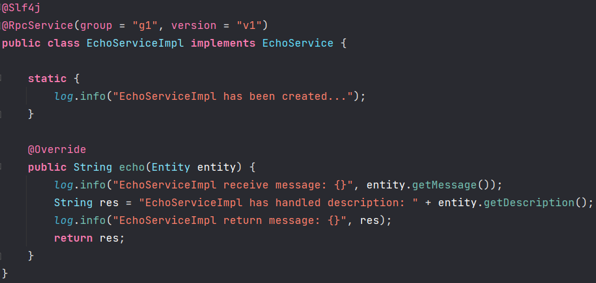
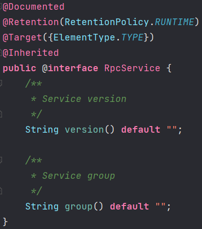
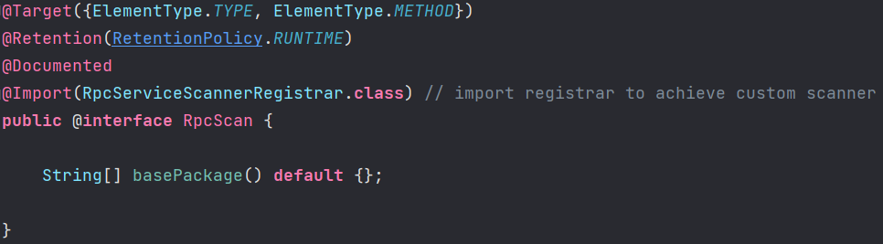
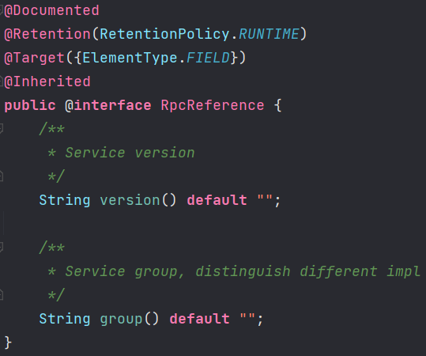
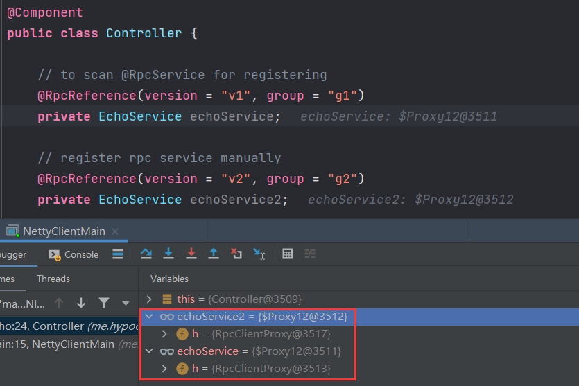

# 扫描注解实现服务注册和消费


📌使用的 `Spring` 框架留的接口和注解配合实现自定义扫描注解


## @RpcService标注服务端提供的实现类

- 服务实现类使用 `@RpcService` 标注，并配置好组名「group」和版本「version」



- `@RpcService` 源码
  - `group` 用于区分同个接口的多种实现
  - `version` 用于接口不兼容升级，版本号过渡。版本号不同的服务相互不调用




## @RpcScan扫描@RpcService服务注册

- `@RpcScan` 源码
  - `@Import` 为 `Spring` 框架提供的导入注解，导入的类自定义扫描后的逻辑




## RpcServiceScannerRegistrar 编写扫描后的注册逻辑

- `ResourceLoaderAware` 接口提供变量 `resourceLoader`
- 实现 `ImportBeanDefinitionRegistrar` 接口，重写 `registerBeanDefinitions` 注册逻辑
- `MyClassPathBeanScanner` 是扫描实现的核心，形参为 `BeanDefinitionRegistry` 和需要扫描的 `Bean Class`
- `@RpcScan` 根据下面实现，会扫描 `@Component` 和 `@RpcService` 的 `bean` 对象

```java
public class RpcServiceScannerRegistrar implements ImportBeanDefinitionRegistrar, ResourceLoaderAware {

    public static final String BEAN_BASE_PACKAGE = "me.hypocrite30";
    private static final String BASE_PACKAGE_ATTRIBUTE_NAME = "basePackage";
    private ResourceLoader resourceLoader;

    @Override
    public void setResourceLoader(ResourceLoader resourceLoader) {
        this.resourceLoader = resourceLoader;
    }

    /**
     * Firstly scan class which has @RpcScan to get all Rpc class
     * Then scan annotated class with @me.hypocrite30.rpc.core.annotation.RpcService | @org.springframework.stereotype.Component
     *
     * @param annotationMetadata     to get annotation meta data
     * @param beanDefinitionRegistry to register bean
     */
    @Override
    public void registerBeanDefinitions(AnnotationMetadata annotationMetadata, BeanDefinitionRegistry beanDefinitionRegistry) {
        // get all annotations' attributes and value, store as LinkedHashMap<String, Object>
        AnnotationAttributes rpcScanAnnotationAttributes = AnnotationAttributes.fromMap(annotationMetadata.getAnnotationAttributes(RpcScan.class.getName()));
        String[] rpcScanBasePackages = new String[0];
        if (rpcScanAnnotationAttributes != null) {
            // get the value of the basePackage attribute
            rpcScanBasePackages = rpcScanAnnotationAttributes.getStringArray(BASE_PACKAGE_ATTRIBUTE_NAME);
        }
        if (rpcScanBasePackages.length == 0) {
            // if have not set basePackage scan path, just scan the value under the corresponding package
            rpcScanBasePackages = new String[]{((StandardAnnotationMetadata) annotationMetadata).getIntrospectedClass().getPackage().getName()};
        }
        // Scan the RpcService annotation
        MyClassPathBeanScanner rpcServiceScanner = new MyClassPathBeanScanner(beanDefinitionRegistry, RpcService.class);
        // Scan the Component annotation
        MyClassPathBeanScanner springBeanScanner = new MyClassPathBeanScanner(beanDefinitionRegistry, Component.class);
        // put ResourceLoader into all scanner
        if (resourceLoader != null) {
            rpcServiceScanner.setResourceLoader(resourceLoader);
            springBeanScanner.setResourceLoader(resourceLoader);
        }
        // scan by ClassPathBeanDefinitionScanner
        int springBeanAmount = springBeanScanner.scan(BEAN_BASE_PACKAGE);
        log.info("spring bean amount: [{}]", springBeanAmount);
        int rpcServiceCount = rpcServiceScanner.scan(rpcScanBasePackages);
        log.info("rpc service amount: [{}]", rpcServiceCount);
    }
}
```

- `MyClassPathBeanScanner` 源码

```java
public class MyClassPathBeanScanner extends ClassPathBeanDefinitionScanner {

    public MyClassPathBeanScanner(BeanDefinitionRegistry registry, Class<? extends Annotation> annoType) {
        super(registry);
        // add filter by annotation type
        super.addIncludeFilter(new AnnotationTypeFilter(annoType));
    }

    /**
     * scan from basePackages
     *
     * @param basePackages base packages
     * @return number of scanned
     */
    @Override
    public int scan(String... basePackages) {
        return super.scan(basePackages);
    }

}
```


## SpringBeanPostProcessor 编写扫描后注册逻辑

- 是一个 `Component` ，能被扫描到作为 Bean 实例注册到 IOC 容器里
- 实现 `BeanPostProcessor` 方法，重写 `postProcessBeforeInitialization` 和 `postProcessAfterInitialization ` 方法，编写发布前后的逻辑

```java
@Slf4j
@Component
public class SpringBeanPostProcessor implements BeanPostProcessor 
```


- 编写 post 之前的逻辑
- 首先判断当前 Bean 是否为 `@RpcService` 服务
- 获取 `RpcService` 的 `group` 和 `version`，并将当前 RpcService 服务对象封装到 `Config` 中，然后交给 `ServiceProvider` 发布该服务到注册中心

```java
@Override
public Object postProcessBeforeInitialization(Object bean, String beanName) throws BeansException {
    if (bean.getClass().isAnnotationPresent(RpcService.class)) {
        log.info("[{}] is annotated with [{}]", bean.getClass().getName(), RpcService.class.getCanonicalName());
        // get @RpcService
        RpcService rpcService = bean.getClass().getAnnotation(RpcService.class);
        // build service config with service bean
        RpcServiceConfig rpcServiceConfig = RpcServiceConfig.builder()
                .group(rpcService.group())
                .version(rpcService.version())
                .service(bean).build();
        serviceProvider.publishService(rpcServiceConfig);
    }
    return bean;
}
```


- 编写 post 之后的逻辑
- 由于客户端没有 RpcService 的实现，需要通过代理类发出 RPC 请求来模拟处理过程；该过程扫描 `@RpcReference` ，然后生成 `ClientProxy` 代理对象，最后将该代理对象替换 bean 的实现
- 在 post bean 之后，获取成员变量，找到带有 `@RpcReference` 的变量，获取需要代理的 group 和 version
- 封装好请求后，生成代理对象，最后把 bean 的实现设置为 RPC 代理对象

```java
@Override
public Object postProcessAfterInitialization(Object bean, String beanName) throws BeansException {
    Class<?> targetClz = bean.getClass();
    Field[] declaredFields = targetClz.getDeclaredFields();
    for (Field declaredField : declaredFields) {
        RpcReference rpcReference = declaredField.getAnnotation(RpcReference.class);
        if (rpcReference != null) {
            RpcServiceConfig rpcServiceConfig = RpcServiceConfig.builder()
                    .group(rpcReference.group())
                    .version(rpcReference.version()).build();
            RpcClientProxy rpcClientProxy = new RpcClientProxy(nettyRpcClient, rpcServiceConfig);
            Object clientProxy = rpcClientProxy.getProxy(declaredField.getType());
            declaredField.setAccessible(true);
            try {
                declaredField.set(bean, clientProxy);
            } catch (IllegalAccessException e) {
                log.error("IllegalAccessException: ", e);
            }
        }
    }
    return bean;
}
```

- `@RpcReference` 源码
  - 用于标识需要代理的 RPC 服务，类似 `@Autowired`，但不是从 IOC 容器中注入 bean。逻辑如上，生成代理对象替代实现，客户端调用，则会代理请求 RPC 服务



- 最终服务被替换为客户端代理对象



